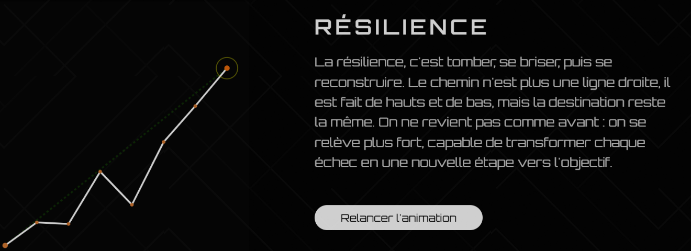
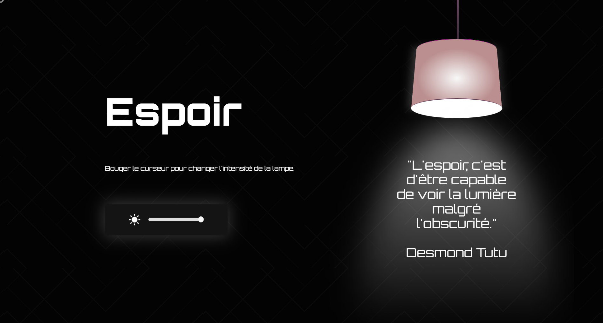

# Projet : Le dépassement de soi

C'est un projet scolaire réalisé en une semaine. L'objectif était de créer des animations web autour de trois émotions
Nous avons choisie de prendre des émotion liees au dépassement de soi : la Détermination, la Résilience et l'Espoir.

## 1. Détermination

On a fait un effet de parallax avec une personne de dos qui regarde le Mont Fuji sous la neige.

- **L'idée :** On s'est inspirés du documentaire "Kaizen" d'Inoxtag. Le sommet représente l'objectif final qui paraît immense. Quand on scroll, la personne se rapproche du sommet pour montrer qu'on avance vers son but.
- **Pourquoi ce choix :** Voir une personne seule face à une montagne, ça symbolise le moment où on se prépare mentalement. C'est l'image de la volonté et du mental qu'il faut avoir avant de s'attaquer à un gros défi.
- **Note :** L'image n'existait pas de base. C'est une composition "faite main" sur Photoshop à partir de 4-5 images différentes. On a dû retravailler les courbes, la luminosité et les couleurs de chaque élément pour que l'incrustation soit propre et naturelle.

## 2. Résilience

On a créé un graphique qui se casse avant de se reconstruire.

- **L'idée :** La ligne s'effondre d'un coup, les points tombent, puis elle repart avec des hauts et des bas.
- **Pourquoi :** La résilience, ce n'est pas une ligne droite. C'est accepter de tomber pour mieux remonter. Les variations du graphique montrent que le parcours est mouvementé mais qu'on finit par remonter.

## 3. L'Espoir

On s'est inspirés d'une phrase de Desmond Tutu : "L'espoir, c'est d'être capable de voir la lumière malgré l'obscurité."

- **L'idée :** Une lampe en CSS permet d'éclaire la citation qui est cachée dans le noir au départ. On a ajouté des lignes légères sur le fond noir pour que l'effet de lumière soit plus réaliste quand on allume la lampe.
- **Pourquoi :** On voulait montrer que l'espoir, c'est un choix. C'est à l'utilisateur d'allumer la lampe pour trouver la phrase.

## Infos techniques

- **Design :** Le site est entièrement sur fond noir. C'est une contrainte voulue pour le parallax, car à un moment on passe "sous le sol" et il fallait que l'immersion reste totale.
- **Typographie :** On a choisi la police Orbitron. Elle a un style futuriste et "carré" qui colle bien avec l'idée de performance et de structure.
- **Stacks :** HTML, CSS (animations et keyframes) et JavaScript pour gérer la neige interactif qui tombe, l'animation du graphique et la lampe.
- **Compatibilité :** Des animation du site ne fonctionent pas sur Firefox et Safari favoriser Edge ou chrome.
